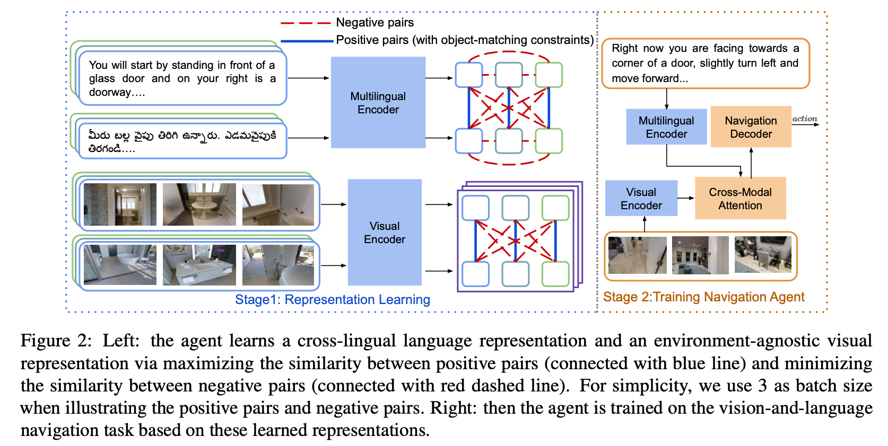

# CLEAR: Improving Vision-Language Navigation with Cross-Lingual, Environment-Agnostic Representations (Findings of NAACL 2022)

* Authors: [Jialu Li](https://jialuli-luka.github.io/), [Hao Tan](https://www.cs.unc.edu/~airsplay/), and [Mohit Bansal](https://www.cs.unc.edu/~mbansal/) (UNC Chapel Hill)

* [Paper](https://arxiv.org/abs/2207.02185)

Vision-and-Language Navigation (VLN) tasks require an agent to navigate through the environment based on language instructions. In this paper, we aim to solve two key challenges in this task: utilizing multilingual instructions for improved instruction-path grounding and navigating through new environments that are unseen during training. To address these challenges, first, our agent learns a shared and visually-aligned cross-lingual language representation for the three languages (English, Hindi and Telugu) in the Room-Across-Room dataset. Our language representation learning is guided by text pairs that are aligned by visual information. Second, our agent learns an environment-agnostic visual representation by maximizing the similarity between semantically-aligned image pairs (with constraints on object-matching) from different environments. Our environment agnostic visual representation can mitigate the environment bias induced by low-level visual information. Empirically, %we show that our agent gets large improvements in all metrics when generalizing to unseen environments with the cross-lingual language representation and the environment-agnostic visual representation, and achieving the new state-of-the-art for multilingual agents on the Room-Across-Room dataset.
on the Room-Across-Room dataset, we show that our multi-lingual agent gets large improvements in all metrics over the strong baseline model
%(over state-of-the-art baselines)
when generalizing to unseen environments with the cross-lingual language representation and the environment-agnostic visual representation.
Furthermore, we show that our learned language and visual representations can be successfully transferred to the Room-to-Room and Cooperative Vision-and-Dialogue Navigation task, and present detailed qualitative and quantitative generalization and grounding analysis.



## Environment Installation

1. Follow instructions [here](https://github.com/clip-vil/CLIP-ViL/tree/master/CLIP-ViL-VLN) to install Matterport3D simulators.

2. Install requirements:

```bash
pip install -r python_requirements.txt
```

3. Download data:

```bash
wget -r https://nlp.cs.unc.edu/data/clear
```

* Image features: `CLIP-ViT-B-32-views.tsv` for CLIP-ViT/32 features, and `ResNet-152-imagenet.tsv` for ResNet features.

* Training Data: `rxr_SPLIT_guide_multi.jsonl`, where `SPLIT` is `train`, `val_seen`, or `val_unseen`

* Data for detected objects in each view: `objects_27.json`

For simplicity, we also provide the learned language and visual representation:

* Language Representation: `encoder_best_val_unseen_loss`

* Visual Representation: `visual_resnet_best_val_unseen_loss` for ResNet features, and `visual_clip_best_val_unseen_loss` for CLIP features

## Code

### Language Representation Learning
```
bash run/lang.bash 0
```
0 is the id of GPU.

### Visual Representation Learning
```
bash run/visual.bash 0
```
0 is the id of GPU.

* `objects_constraints`: path to the file containing objects in each view.

### VLN Training
```
bash run/agent.bash 0
```
0 is the id of GPU.

* `dataset`: `RxR`, `R2R`, `CVDN`

* `load_encoder`: path to learned language representation

* `load_visual`: path to learned visual representation

* `feature_size`: `2048` to use ResNet features, `512` to use CLIP-ViT/32 features


## Citation

If you find this work useful, please consider citing:

```bibtex
@inproceedings{li2022clear,
  title     = {CLEAR: Improving Vision-Language Navigation with Cross-Lingual, Environment-Agnostic Representations},
  author    = {Jialu Li, Hao Tan, Mohit Bansal},
  booktitle = {Findings of NAACL},
  year      = {2022}
}
```

## Acknowledgement:

We thank the developers of [EnvDrop](https://github.com/clip-vil/CLIP-ViL/tree/master/CLIP-ViL-VLN), [HAMT](https://github.com/cshizhe/VLN-HAMT), [CLIP](https://github.com/openai/CLIP) for their public code release.
